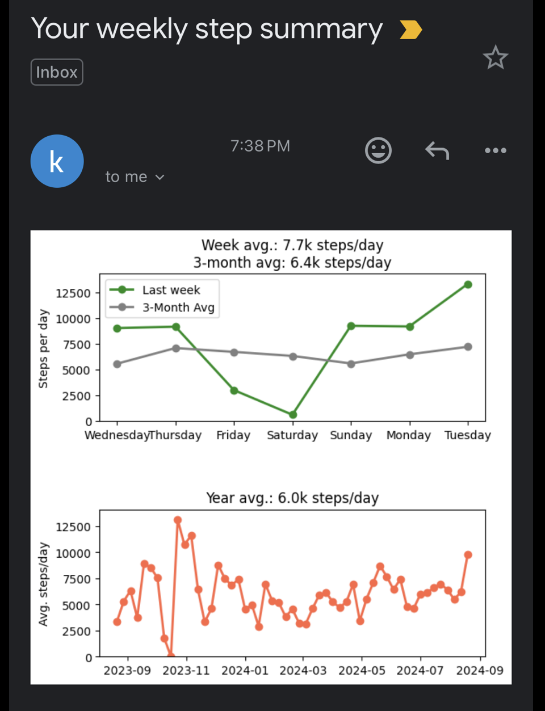
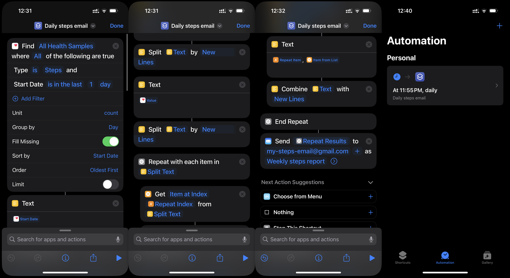

# Every Step You Take – Weekly Insights from Your iPhone Step Data



Tracking your daily steps is a straightforward way to monitor your activity levels, but keeping an eye on your progress over time can be a hassle. This project automates the process, delivering a clear summary of your weekly step count directly to your inbox using data from your iPhone.

With Every Step You Take, your step data is collected, analyzed, and compiled into a concise weekly report for your email inbox. This summary gives you a practical overview of your activity trends, helping you stay informed and make adjustments as needed to reach your fitness goals.

<br clear="left"/>

## Features
- Access your iPhone step data from Health, without a seperate app
- Automatic insights to your inbox of your weekly step history
- Step counting is simplest activity tracker, doesn't require wearables

## Setup
There are three parts to the workflow:
1. A Shortcut and Automation on iPhone to send step data over email
2. A Cloud Function triggered daily (Cloud Scheduler) to upload daily step data to Firestore
3. A Cloud Function triggered weekly to analyse the step history and send and email

### Setup Shortcut and Automation (iPhone)
- Upload the shortcut in iPhone>Daily steps email.shortcut to iPhone
The iPhone shortcut reads step data from Health from the last day and sends as an email. Body in the form of date, step_count (e.g. 2024-08-18, 12518)
Automations with email cannot run automatically on lock screen. Instead:
- Set an automation to turn on aeroplane mode at 12 am each night
- Set another automation to trigger the shortcut when aeroplane is turned off (i.e. in the morning when phone is checked)



### Create a Gmail account
Create a gmail account to receive daily step data, and send the weekly summary

To allow read access:
- Enable IMAP under settings
To allow send access:
- In Gmail, setup an app password, password. 2FA needs to be enabled, then create at https://myaccount.google.com/apppasswords
- Create a .env in local directory and add as GMAIL_APP_PASSWORD="your app password"


### Create a Google Cloud project
Note, the dedicated gmail doesn't need to be in the same workspace as the Google Cloud project. OAuth is used to authenticate gmail access
Enable API & Services for:
- Gmail API - for reading emails and marking as read
- Cloud storage - for storing token for gmail read access
- Firestore – for storing step history
- Cloud run functions – for two scripts, daily step count uploads and weekly summary email
- Cloud scheduler - for triggering daily and weekly jobs

#### OAuth for Gmail
- Create OAuth consent screen
  - Scopes need to include .../auth/gmail.modify and .../auth/gmail.readonly
- Create OAuth credentials
  - Credentials > Create Credentials > Create OAuth client ID (Application type: Desktop app)
- Download .json, save as oauth_credentials.json in local directory

Program authenticates through OAuth screen once. Stores token in Google Storage bucket. Subsequent authentication accesses this bucket, to refresh the token. This means the program needs to be run once locally, to follow the Oauth workflow, before it will work as a cloud function

#### Set up Firestore
- Create service account, give roles for Firestore
    - Requires Cloud Datastore User, Firebase Admin SDK Administrator Service Agent, 
    Firebase Rules System, Firestore Service Agent, Cloud Storage for Firebase Admin
- Create .json key and download, save as ./google_service_account_credentials.json

- Create a Firestore database
  - Leave name as (default)

#### Deploy Cloud Functions
Ensure service account associated with project has required permissions with:
```
gcloud projects add-iam-policy-binding [PROJECT-ID] \
  --member="serviceAccount:[PROJECT-ID]@appspot.gserviceaccount.com" \
  --role="roles/cloudfunctions.developer"
```
```
gcloud projects add-iam-policy-binding [PROJECT-ID] \
  --member="serviceAccount:[PROJECT-ID]@appspot.gserviceaccount.com" \
  --role="roles/cloudfunctions.invoker"
```

Deploy script which updates steps history:
```
gcloud functions deploy run_steps_history_updater \
    --gen2 \
    --entry-point run_steps_history_updater \
    --runtime python39 \
    --trigger-http \
    --allow-unauthenticated \
    --memory 512MB \
    --timeout 540s \
    --region us-central1
```
Deploy script which sends :
```
gcloud functions deploy run_steps_email_sender \
    --gen2 \
    --entry-point run_steps_email_sender \
    --runtime python39 \
    --trigger-http \
    --allow-unauthenticated \
    --memory 512MB \
    --timeout 540s \
    --region us-central1 \
    --set-env-vars GMAIL_APP_PASSWORD="$(sed -n 's/^GMAIL_APP_PASSWORD="\(.*\)"/\1/p' .env)"
```
#### Schedule jobs
In Cloud Scheduler > Create 
- For daily_steps_history_update, Frequency 0 12 * * * (12:00 every day)
- For weekly_steps_email_sender, Frequency 30 12 * * 1 (12:30 every Monday)

Target type HTTP
URL: https://us-central1-[PROJECT-ID].cloudfunctions.net/run_steps_history_updater 
HTTP method: POST
Auth header: Add OIDC token
Service account: App Engine default service account ([PROJECT-ID]@appspot@gserviceaccount.com)


### Userful gcloud functions, handling accounts and projects
- Check login with `glcoud auth list`
- Change account with `gcloud config set account email_address`
- Check the project with `gcloud config get-value project`
- Change the project with `gcloud config set project YOUR-PROJECT-ID`
- List all service accounts in project `gcloud iam service-accounts list`
- Default service account should be: [PROJECT-ID]@appspot.gserviceaccount.com
- Ensure default service account has necessary permissions 

## Running

### Run locally
- To have this working locally add with .env with:
RUNNING_LOCALLY=True

- Run `python3 main.py` to start the flask server

#### Steps History Updater
`curl -X POST http://localhost:8080/run_steps_history_updater`

#### Steps Email Sender
`curl -X POST http://localhost:8080/run_steps_email_sender`


### Run cloud function
```
gcloud functions call run_steps_history_updater --region us-central1
```
```
gcloud functions call run_steps_email_sender --region us-central1
```

