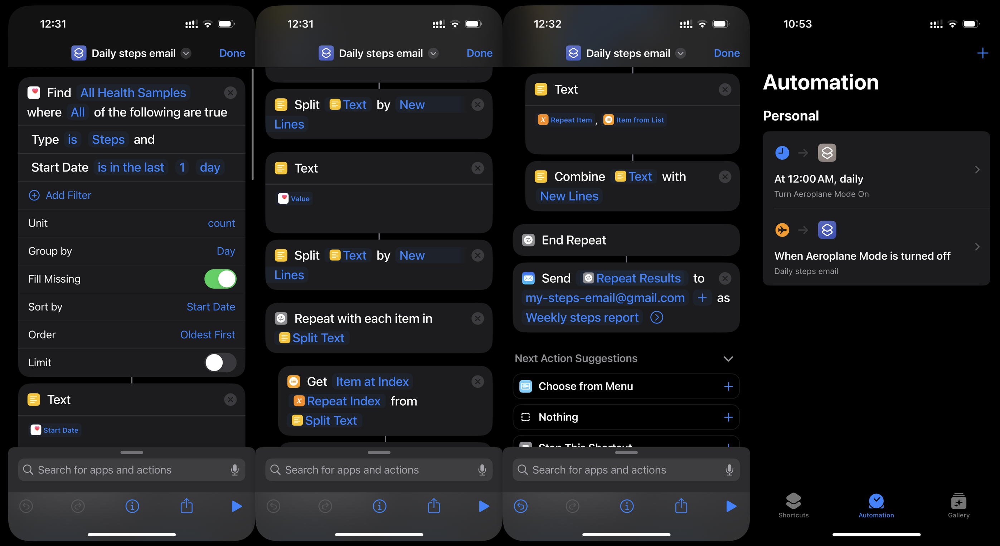

# Every Step You Take


## Set up Automation on iPhone
- Shortcut for iPhone (iPhone>Daily steps email.shortcut) reads step data from Health from the last day
- Changes this to a list in form date, step_count (e.g. 2024-08-18, 12518)
- Sends in the body of an email




## Set up Google Cloud platform
- Enable Gmail API
- Enable OAuth consent screen
- Create Credentials for OAuth 2.0, download .json, save as oauth_credentials.json in local directory

- Program authenticates through OAuth screen once. Stores token in Google Storage bucket
- Subsequent authentication accesses this bucket, to refresh the token

## Set up Firestore
- Enable API in Google cloud project
- Create service account, give roles for Firestore
    - Requires Cloud Datastore User, Firebase Admin SDK Administrator Service Agent, 
    Firebase Rules System, Firestore Service Agent, Cloud Storage for Firebase Admin
- Create .json key and download

- Create a Firestore database
  - Leave name as (default)

## Set up Email sender
- In Gmail, setup an app password, password. 2FA needs to be enabled, then create at https://myaccount.google.com/apppasswords
- Create a .env and add as GMAIL_APP_PASSWORD="app password"


## Cloud functions
- Enable Cloud Functions, Cloud Build, Cloud Run

- Run locally once to set up the gmail authentication token. This is then stored in the gcloud bucket automatically

Userful gcloud functions, handling accounts and projects
- Check login with `glcoud auth list`
- Change account with `gcloud config set account email_address`
- Check the project with `gcloud config get-value project`
- Change the project with `gcloud config set project YOUR-PROJECT-ID`
- List all service accounts in project `gcloud iam service-accounts list`
- Default service account should be: [PROJECT-ID]@appspot.gserviceaccount.com
- Ensure default service account has necessary permissions 

## Running locally
- To have this working locally add with .env with:
RUNNING_LOCALLY=True

- Run `python3 main.py` to start the flask server

#### Steps History Updater
`curl -X POST http://localhost:8080/run_steps_history_updater`

#### Steps Email Sender
`curl -X POST http://localhost:8080/run_steps_email_sender`

### Pushing as a cloud function
- Ensure service account associated with project has required permissions:
```
gcloud projects add-iam-policy-binding [PROJECT-ID] \
  --member="serviceAccount:[PROJECT-ID]@appspot.gserviceaccount.com" \
  --role="roles/cloudfunctions.developer"
```
```
gcloud projects add-iam-policy-binding [PROJECT-ID] \
  --member="serviceAccount:[PROJECT-ID]@appspot.gserviceaccount.com" \
  --role="roles/cloudfunctions.invoker"
```
### Deploy cloud function
History updater:
```
gcloud functions deploy run_steps_history_updater \
    --gen2 \
    --entry-point run_steps_history_updater \
    --runtime python39 \
    --trigger-http \
    --allow-unauthenticated \
    --memory 512MB \
    --timeout 540s \
    --region us-central1
```
Email sender:
```
gcloud functions deploy run_steps_email_sender \
    --gen2 \
    --entry-point run_steps_email_sender \
    --runtime python39 \
    --trigger-http \
    --allow-unauthenticated \
    --memory 512MB \
    --timeout 540s \
    --region us-central1 \
    --set-env-vars GMAIL_APP_PASSWORD="$(sed -n 's/^GMAIL_APP_PASSWORD="\(.*\)"/\1/p' .env)"
```
- Run with
```
gcloud functions call run_steps_history_updater --region us-central1
```

```
gcloud functions call run_steps_email_sender --region us-central1
```

#### Schedule
- Create cron job in Google Cloud Scheduler
In Cloud Scheduler > Create 
- For daily_steps_history_update, Frequency 5 0 * * * (00:05 every day)
- For weekly_steps_email_sender, Frequency 0 5 * * 1 (05:00 every Monday)

Target type HTTP
URL: https://us-central1-[PROJECT-ID].cloudfunctions.net/run_steps_history_updater 
HTTP method: POST
Auth header: Add OIDC token
Service account: App Engine default service account ([PROJECT-ID]@appspot@gserviceaccount.com)

- Change the timeout with:
```
gcloud scheduler jobs update http weekly-metrics --attempt-deadline=600s
```